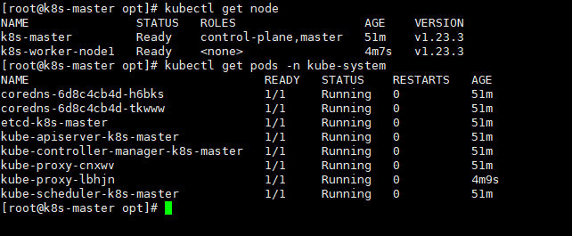

## 1.前置说明
> Docker版本：20.10.12
>
> Kubernetes版本：1.23.3

| 操作系统 | IP地址 | 配置 | 说明 |
| --- | --- | --- | --- |
| CentOS Linux release 7.6.1810 (Core) | 192.168.72.5 | 4C2G | k8s-master |
| CentOS Linux release 7.6.1810 (Core) | 192.168.72.6 | 2C2G | k8s-worker-node1 |

## 2.系统初始化
> 在每台机器上都执行以下命令

```bash
# 关闭防火墙
systemctl stop firewalld
# 禁用 firewalld 服务
systemctl disable firewalld

# 关闭 selinux
# 临时关闭【立即生效】告警，不启用，Permissive，查看使用 getenforce 命令
setenforce 0  
# 永久关闭【重启生效】
sed -i 's/SELINUX=enforcing/\SELINUX=disabled/' /etc/selinux/config  

# 关闭 swap
# 临时关闭【立即生效】查看使用 free 命令
swapoff -a 
# 永久关闭【重启生效】
sed -ri 's/.*swap.*/#&/' /etc/fstab

# 在主机名静态查询表中添加 2 台主机
cat >> /etc/hosts << EOF
192.168.72.5 k8s-master
192.168.72.6 k8s-worker-node1
EOF

# 将桥接的 IPv4 流量传递到 iptables 的链
cat > /etc/sysctl.d/k8s.conf << EOF
net.bridge.bridge-nf-call-ip6tables = 1
net.bridge.bridge-nf-call-iptables = 1
EOF
# 使 k8s 配置生效
sysctl --system  

# 时间同步
yum install ntpdate -y
ntpdate time.windows.com

# 根据规划设置主机名【k8s-master 节点上操作】
hostnamectl set-hostname k8s-master
# 根据规划设置主机名【k8s-worker-node1 节点上操作】
hostnamectl set-hostname k8s-worker-node1

# 重启机器
reboot
```
## 3.安装docker
> 在每台机器上都执行以下命令

```bash
# 1.卸载旧版本
sudo yum remove docker \
                  docker-client \
                  docker-client-latest \
                  docker-common \
                  docker-latest \
                  docker-latest-logrotate \
                  docker-logrotate \
                  docker-engine
# 2.添加docker-ce yum源
//扩展yum功能
yum install -y yum-utils
//添加软件源信息
yum-config-manager --add-repo http://mirrors.aliyun.com/docker-ce/linux/centos/docker-ce.repo
//自动选择最快yum仓库源
yum makecache fast
# 3.查看当前可以安装docker-ce版本
yum list docker-ce --showduplicates | sort -r
# yum -y install docker-ce-[VERSION]    //安装指定版本的格式 ,注意3:xxx 请移除3:
# 4.安装docker
yum install -y docker-ce-20.10.12 docker-ce-cli-20.10.12
```
```bash
# 5.修改docker配置-cgroup 的驱动程序改成 systemd
mkdir /etc/docker
cat >> /etc/docker/daemon.json << EOF
{
  "exec-opts": ["native.cgroupdriver=systemd"],
  "log-driver": "json-file",
  "log-opts": {
    "max-size": "100m"
  },
  "storage-driver": "overlay2"
}
EOF
```
```bash
# 6.启动docker
systemctl enable docker
systemctl daemon-reload
systemctl start docker
systemctl status docker
```
## 4.安装kubeadm
> 在每台机器上都执行以下命令

```bash
# 配置 k8s 的 yum 源【阿里云】
cat > /etc/yum.repos.d/kubernetes.repo << EOF
[kubernetes]
name=Kubernetes
baseurl=https://mirrors.aliyun.com/kubernetes/yum/repos/kubernetes-el7-x86_64
enabled=1
gpgcheck=0
repo_gpgcheck=0
gpgkey=https://mirrors.aliyun.com/kubernetes/yum/doc/yum-key.gpg https://mirrors.aliyun.com/kubernetes/yum/doc/rpm-package-key.gpg
EOF

# 安装 kubelet、kubeadm、kubectl，同时指定版本
yum install -y kubeadm-1.23.3 kubelet-1.23.3 kubectl-1.23.3
# 设置开机自启【这里暂时先不启动 kubelet】
systemctl enable kubelet
```
## 5.安装k8s-master节点
```bash
kubeadm init --pod-network-cidr=10.244.0.0/16 --apiserver-advertise-address=192.168.72.5 --kubernetes-version v1.23.3 --service-cidr=10.96.0.0/12 --image-repository registry.aliyuncs.com/google_containers

mkdir -p $HOME/.kube
sudo cp -i /etc/kubernetes/admin.conf $HOME/.kube/config
sudo chown $(id -u):$(id -g) $HOME/.kube/config
```
## 6.在k8s-master节点安装 Flannel 网络插件
```bash
wget https://raw.githubusercontent.com/coreos/flannel/master/Documentation/kube-flannel.yml
# 添加
kubectl apply -f kube-flannel.yml
# 查看状态 【kube-system 是 k8s 中的最小单元】
kubectl get pods -n kube-system
kubectl get node
```
## 7.安装k8s-worker-node1节点
```bash
kubeadm join 192.168.72.5:6443 --token ywtnex.9mb4fmopgte85d9a \
	--discovery-token-ca-cert-hash sha256:b531439b43991d4ed4da6d64354615936e21c4b3986e54d2305995537558619c
```

## 8.测试
```bash
kubectl run ngx --image=nginx:alpine
kubectl get pod -o wide
```

## 9.k8s-worker-node1节点使用kubectl
```bash
# k8s-worker-node1执行
mkdir -p $HOME/.kube
# k8s-master执行
scp ~/.kube/config root@192.168.72.6:~/.kube/
```
